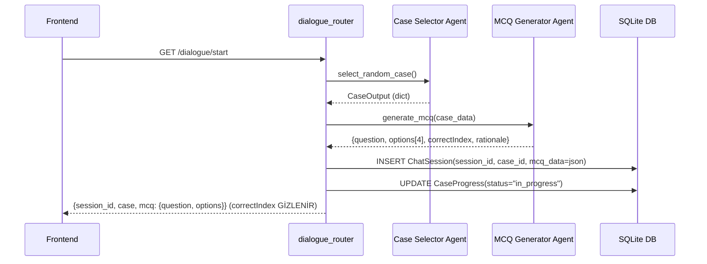
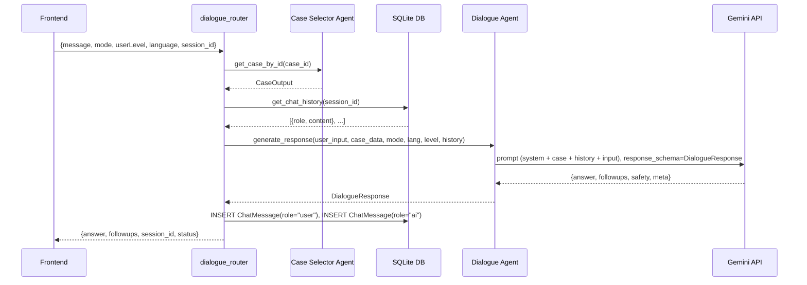
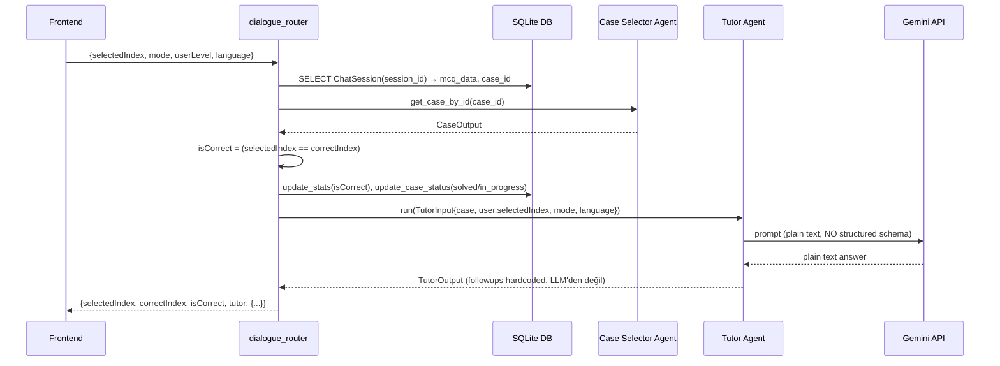

# MedCase AI — Sistem Mimarisi (v1.0)

> **Kapsam:** Bu doküman, tez danışmanı geri bildiriminin 1. maddesine karşılık gelir:
> *"Sistem mimarisini ayrıntılı olarak tasarla. Her ajanın görevi, kullandığı prompt yapısı, giriş-çıkışları ve ajanlar arasındaki iletişim net olarak tanımlanmalı."*
>
> Doküman, **mevcut kod tabanının** (2026-07-26 tarihli `main` dalı) tersine mühendislik yoluyla çıkarılmış gerçek mimarisini belgeler; icat edilmiş bir hedef mimari değildir. Bölüm 7'de tespit edilen boşluklar sadece **not** olarak düşülmüştür, bu iterasyonda düzeltilmemiştir (o işler roadmap'in ilerleyen maddelerine bırakılmıştır).

---

## 0. Üst Düzey Bileşen Diyagramı

```mermaid
flowchart LR
    subgraph Client["📱 medcase-frontend (Expo / React Native)"]
        UI[Case List / Chat / Report UI]
    end

    subgraph API["🖥️ medcase-backend (FastAPI, main.py)"]
        R1[/dialogue router/]
        R2[/tutor router/]
        R3[/user router/]

        subgraph Agents["Ajanlar"]
            CS[Case Selector Agent\n(deterministic, LLM yok)]
            MG[MCQ Generator Agent\n(LLM)]
            DA[Dialogue Agent\n(LLM, Sokratik)]
            TA[Tutor / Feedback Agent\n(LLM)]
        end

        DB[(SQLite: ChatSession / ChatMessage / CaseAnswer /\nUserStats / CaseProgress / Case)]
        SEED[[services/seed_cases.py\n(tek seferlik JSON→SQL aktarımı)]]
        DATA[(data/cases_subset.json\n200 vaka — yalnızca seed kaynağı)]
    end

    LLM[["Google Gemini API\n(gemini-3.1-flash-lite, GEMINI_MODEL env)"]]

    UI <-- REST/JSON --> R1
    UI <-- REST/JSON --> R2
    UI <-- REST/JSON --> R3

    R1 --> CS
    R1 --> MG
    R1 --> DA
    R1 --> TA
    R2 --> TA

    CS -- SQL query --> DB
    SEED -- app başlangıcında,\ntablo boşsa tek seferlik --> DB
    DATA -.-> SEED
    MG -. prompt/response .-> LLM
    DA -. prompt/response .-> LLM
    TA -. prompt/response .-> LLM

    R1 --> DB
    R3 --> DB
```

**Önemli sınıflandırma:** Bu sistemde ajanlar birbirini **doğrudan çağırmaz** (agent-to-agent / A2A mesajlaşma yoktur). Tüm koordinasyon, FastAPI router katmanında (`routers/dialogue_router.py`, `routers/tutor_router.py`) **hardcoded, sabit sıralı** Python fonksiyon çağrıları ile yapılır. Router burada fiilen bir **Orkestratör** rolü oynar, ama bu rol koda dağılmış durumda, ayrı bir "Orchestrator Agent" sınıfı yoktur. Bölüm 6'da bunun akademik olarak nasıl adlandırılması gerektiği tartışılıyor.

---

## 1. Ajan Envanteri

| # | Ajan | Dosya | Tür | LLM? | Model | Durum (state) |
|---|------|-------|-----|------|-------|----------------|
| 1 | **Case Selector Agent** | `case_selector/selector_agent.py` | Deterministic seçim + validasyon (SQL) | Hayır | — | Stateless |
| 2 | **MCQ Agent** | `mcq/mcq_agent.py` | Üretici (generation) | Evet | `gemini-3.1-flash-lite` | Stateless (her çağrıda sıfırdan üretim) |
| 3 | **Dialogue Agent** | `dialogue/dialogue_agent.py` + `prompts/dialogue_v1.0.txt` | Sokratik öğretici | Evet | `gemini-3.1-flash-lite` | Stateless ajan, ama **DB'den beslenen** konuşma geçmişi ile "hafızalı" davranır |
| 4 | **Tutor / Feedback Agent** | `tutor/tutor_agent.py` + `prompts/tutor_mcq_v1.0.txt`, `prompts/tutor_narrative_v1.0.txt` | Değerlendirici / geri bildirim | Evet | `gemini-3.1-flash-lite` | Stateless |

Destekleyici (ajan olmayan) servisler: `services/database.py`, `services/db_service.py` (SQLAlchemy DB katmanı, tüm oturum/geçmiş verisinin tek kaynağı), `services/gemini_client.py` (dört ajanın da paylaştığı tek Gemini istemcisi), `services/prompt_loader.py` (versiyonlanmış prompt dosyalarını yükler), `services/logging_config.py` (INFO/WARNING/ERROR ayrı log dosyaları).

> **2026-07-26 güncellemesi:** Model adı `gemini-1.5-flash`'ten `gemini-3.1-flash-lite`'a değişti (eskisi Gemini API'sinden tamamen kaldırılmıştı, bkz. Bölüm 6 madde 7). `services/mcq_generator.py` → `mcq/mcq_agent.py` olarak taşındı (diğer üç ajanla aynı klasör yapısı). `services/session_store.py` ve `services/case_service.py` tamamen kaldırıldı.

---

## 2. Ajan Detayları

### 2.1 Case Selector Agent

**Görev:** Vaka verisini **SQLite `cases` tablosundan SQL sorgusuyla** çeker (rastgele seçim veya ID ile getirme); satırı Pydantic şemasıyla doğrulayıp temizler (resim URL'si kurma, rubric güvenli varsayılan doldurma).

> **Veri kaynağı geçişi (2026-07-26):** Başlangıçta bu ajan `data/cases_subset.json`'ı doğrudan RAM'e yükleyip oradan serviyordu. Artık veri, uygulama ilk ayağa kalktığında `services/seed_cases.py` tarafından **tek seferlik, idempotent** bir işlemle `cases` tablosuna aktarılıyor (tablo doluysa seed atlanır) ve ajan her istekte **SQLAlchemy üzerinden SQL sorgusu** çalıştırıyor (`ORDER BY RANDOM()` ile rastgele seçim, `WHERE id = ...` ile tekil getirme). JSON dosyası artık yalnızca **ilk yükleme (seed) kaynağı**, çalışma zamanı veri kaynağı değil. Dış sözleşme (`CaseOutput` şeması) değişmedi — bu saf bir veri katmanı değişimi, tüketen taraflarda (Dialogue/Tutor Agent, frontend) hiçbir değişiklik gerekmedi.

**Girdi:**
- `select_random_case(db: Session, specialty: Optional[str] = None)` → session + isteğe bağlı branş filtresi (ör. `"Cardiology"`) — **2026-07-26'dan itibaren**: `GET /dialogue/start?specialty=...` bu parametreyi geçiriyor; önceden bu parametre hem frontend'de hem backend'de yok sayılıyordu (Home ekranındaki "Change Specialty" seçici görsel olarak çalışıyor ama fiilen filtre uygulamıyordu — kullanıcı tarafından test edilip bulundu). Artık `WHERE specialty = ...` ile SQL seviyesinde filtreleniyor; eşleşen vaka yoksa `404` + açıklayıcı hata.
- `get_case_by_id(db: Session, case_id: str)` → session + `case_id`

**Çıktı — `CaseOutput` şeması** (`case_selector/schemas.py`):
```python
class CaseRubric(BaseModel):
    chief_complaint: str = ""
    red_flags: List[str] = []
    ddx_top: List[str] = []
    tests_initial: List[str] = []
    management_initial: List[str] = []
    pitfalls: List[str] = []

class CaseOutput(BaseModel):
    id: str
    title: str
    specialty: str = "General"
    difficulty: str = "Intermediate"
    narrative: str
    image: Optional[str] = None
    rubric: CaseRubric = CaseRubric()
    seed_questions: List[str] = []
    source: Optional[CaseSource] = None  # 2026-07-26'dan itibaren — bkz. aşağı

class CaseSource(BaseModel):
    title: Optional[str] = None
    url: Optional[str] = None
    doi: Optional[str] = None
    authors: Optional[str] = None
    year: Optional[int] = None
    license_name: Optional[str] = None
    license_url: Optional[str] = None
    citation_text: Optional[str] = None
```

**Prompt yapısı:** Yok — bu ajan LLM çağırmaz, tamamen deterministik Python mantığıdır (`random.choice`, sözlük araması, Pydantic validasyonu).

**Not:** Gerçek veri setinde `rubric` alanları **her zaman boş**, `seed_questions` **hiç dolu değil** (bkz. Bölüm 7.1). Şema bu alanları destekliyor ama veri üretim hattı henüz doldurmuyor.

**Kaynak/lisans metadata (2026-07-26'dan itibaren):** `Case` tablosuna [dataset.md](dataset.md) §6'da anlatılan `source_*`/`license_*`/`citation_text` sütunları eklenip 200 vakanın tamamı NCBI'den çekilen gerçek metadata ile dolduruldu (bkz. `services/backfill_source_metadata.py`). `rubric`/`seed_questions`'ın aksine, bu alan artık **doldurulmuş durumda** — frontend'de "Clinical File" raporunun altında bir "SOURCE" bölümü olarak gösteriliyor.

---

### 2.2 MCQ Agent

**Görev:** Seçilen vakanın `narrative` metninden, yalnızca vaka içeriğine dayanan **tek bir 4 şıklı çoktan seçmeli soru** üretir. Modelin ürettiği şık sırasını **Python tarafında karıştırıp** doğru cevabın hep aynı şıkta çıkmasını engeller (LLM'in position-bias'ını nötralize eden bir post-processing adımı).

**Girdi:** `case: Dict` → kullanılan alanlar: `id`, `narrative`, `specialty`, `difficulty`.

**Prompt yapısı** (`prompts/mcq_v1.1.txt`, `services/prompt_loader.py` ile yüklenip `string.Template` üzerinden doldurulur; tek parça system+user birleşik prompt):
```
SYSTEM (sabit talimat bloğu):
  "You are generating ONE assessment-quality multiple-choice question..."
  - Kısıt: yalnızca verilen narrative kullanılacak, dış bilgi eklenmeyecek
  - Tam 4 şık (A-D), belirgin şekilde ayrışık
  - Rationale ≥2-3 cümle, vakadan en az bir somut klinik bulguya atıf yapmalı
  - Yüzeysel rationale ("because it is correct" vb.) yasak
  - Dil: yalnızca İngilizce

USER (değişken veri bloğu):
  CASE_ID: {case_id}
  SPECIALTY: {specialty}
  DIFFICULTY: {difficulty}
  NARRATIVE:
  {narrative}
```

**Şema zorlaması (2026-07-26'dan itibaren — `mcq/schemas.py::MCQOutput`):** Dialogue Agent (2.3) ile aynı mekanizma: Gemini SDK'nın `response_schema` özelliği ile **yapısal olarak** zorlanıyor, serbest metin + manuel `json.loads()` yok. İç içe modeller:
```python
class MCQOption(BaseModel):
    id: Literal["A", "B", "C", "D"]
    text: str = Field(min_length=1)

class DistractorExplanation(BaseModel):
    option_id: Literal["A", "B", "C", "D"]
    explanation: str = Field(min_length=1)

class MCQOutput(BaseModel):
    question: str = Field(min_length=10)
    options: List[MCQOption] = Field(min_length=4, max_length=4)
    correct_option_id: Literal["A", "B", "C", "D"]
    rationale: str = Field(min_length=20)
    distractor_explanations: Optional[List[DistractorExplanation]] = None
    # + model_validator: 4 benzersiz id (A/B/C/D tamamı), şık metinleri
    #   benzersiz/boş-değil, correct_option_id gerçek bir şıkka referans
    #   veriyor, rationale bilinen yüzeysel ifadelerden biri değil
```
**Önemli API kısıtı:** Gemini'nin `response_schema`'sı açık/serbest `Dict[str, str]` alanlarını desteklemiyor (`additionalProperties` hatası veriyor) — bu yüzden `distractor_explanations` bir dict değil, sabit şekilli `List[DistractorExplanation]` olarak tasarlandı. Bu, geliştirme sırasında gerçek bir API çağrısıyla ampirik olarak tespit edildi.

Gemini SDK, şema doğrulaması (özel `model_validator` dahil) başarısız olursa `response.parsed`'ı sessizce `None` bırakıyor (exception fırlatmıyor) — `response.text` ise ham (şema-şekli-geçerli ama semantik olarak reddedilmiş) çıktıyı hâlâ içeriyor. Bu davranış, aşağıdaki repair akışını mümkün kılıyor.

**Çıktı — iki katman:**
1. **İç temsil:** `MCQOutput` (yukarıdaki şema) — `mcq/mcq_agent.py` içinde üretilir/doğrulanır.
2. **Dış sözleşme (değişmedi):** `generate_mcq()` hâlâ eski düz `dict` şeklini döndürür — `{question, options: List[str], correctIndex: int, rationale: str}` — böylece `routers/dialogue_router.py` ve `evaluation/multi_agent_runner.py` gibi tüketiciler hiç değişmedi. Şık sırası burada, `MCQOutput.options`'tan metinler çıkarılıp Python tarafında karıştırıldıktan sonra kuruluyor (LLM'in position-bias'ını nötralize eden post-processing adımı, önceki davranışla aynı).

**Hata yönetimi (2026-07-26'dan itibaren, tek repair denemeli):**
1. İlk üretim denemesi (`response_schema=MCQOutput`).
2. `response.parsed is None` ise (şema/validator başarısız) → modele **kendi hatalı çıktısı + hata mesajı** gösterilip **tek bir repair denemesi** yapılır (`_build_repair_prompt`).
3. Repair de başarısız olursa, yapılandırılmış bir hata loglanır (`{"error_code": "MCQ_SCHEMA_VALIDATION_FAILED", "case_id", "attempts": 2}`) ve sabit fallback MCQ'ya ("Seçenek A/B/C/D") düşülür — istisna yükseltilmez, kullanıcı akışı kesilmez.

Bu değişiklik, roadmap madde 3 kapsamında çalıştırılan 10-vakalık pilot deneyde (bkz. [evaluation_plan.md](evaluation_plan.md) §Hafta 3) gerçek bir hatayı düzeltti: bir vakada (`PMC2810581_34430`) Gemini'nin `rationale` alanını hiç döndürmediği, eski gevşek doğrulamanın (yalnızca anahtar varlığı kontrolü) bunu yakalayamadığı görüldü; yeni şema + repair akışıyla aynı vaka artık başarıyla, yüksek kaliteli çıktı üretiyor.

---

### 2.3 Dialogue Agent (Sokratik Diyalog Ajanı)

**Görev:** Öğrenciyle vaka üzerinde Sokratik yöntemle diyalog kurar; doğrudan tanı/cevap vermek yerine yönlendirici sorularla düşünmeye teşvik eder. Üç ayrı **mod** (`hint`, `explain`, `teach`) ile yanıtın uzunluğunu ve derinliğini kasıtlı olarak farklılaştırır.

**Girdi (`generate_response` imzası):**
| Parametre | Tür | Açıklama |
|---|---|---|
| `user_input` | str | Öğrencinin serbest metin mesajı |
| `case_data` | dict | `CaseOutput` çıktısı (Case Selector Agent'tan) |
| `mode` | "hint"\|"explain"\|"teach" | Varsayılan "hint" |
| `language` | "tr"\|"en" | Varsayılan "tr" (ama sistem promptu yanıtın **her zaman İngilizce** olmasını zorunlu kılıyor — bkz. Bölüm 7.2 çelişkisi) |
| `user_level` | str | "beginner" vb. |
| `chat_history` | list[{role, content}] | Router tarafından **DB'den çekilip** enjekte edilen önceki tur(lar) |

**Prompt yapısı** (`dialogue/prompts.py` → `DIALOGUE_SYSTEM_PROMPT`, ~230 satırlık ayrıntılı sistem promptu + `dialogue_agent.py` içinde birleştirilen dinamik blok):
```
[DIALOGUE_SYSTEM_PROMPT — sabit, büyük sistem talimatı]
  - Rol tanımı: "teaching assistant", klinisyen DEĞİL
  - Sokratik kural: nihai tanıyı hemen verme, yönlendirici soru sor
  - Moda göre KESİN DAVRANIŞ FARKLILIĞI:
      hint   → kısa (3-7 cümle), tanıyı ASLA açıklama, 1-2 yönlendirici soru
      explain→ uzun (8-16+ cümle), nedensellik zinciri, opsiyonel 1 followup
      teach  → çok uzun, 6 adımlı mini-ders formatı (yaklaşım→ayırıcı tanı
               kovaları→bulgular→olası yön→tuzaklar→çıkarımlar)
  - Görsel varsa: halüsinasyon yapma, tanımlayıcı dille değin
  - Güvenlik: eğitim amaçlı olduğunu belirt, gerçek tedavi talimatı verme
  - Çıktı formatı: KATI JSON şeması (aşağıya bakınız)

LANGUAGE: {language}
USER_LEVEL: {user_level}
MODE: {mode}
CASE DATA: {case_str}          # tüm CaseOutput JSON'ı gömülü
--- PREVIOUS CHAT HISTORY ---  # varsa, USER/AI MENTOR etiketleriyle
USER (Current Input): {user_input}
```

**Çıktı — yapısal JSON zorlaması var** (`response_mime_type: application/json`, `response_schema: DialogueResponse`):
```python
class DialogueResponse(BaseModel):
    answer: str
    followups: List[str]
    safety: SafetyInfo        # {medical: "educational_only", note: str}
    meta: MetaInfo             # {mode, specialty}
```

**Durum yönetimi:** Ajanın kendisi **stateless**'tir (her çağrıda yeni prompt kurar); "hafıza" illüzyonu, router'ın her istekte DB'den (`ChatMessage` tablosu) geçmişi çekip prompt'a metin olarak gömmesiyle sağlanır. Yani konuşma durumu ajanda değil, **paylaşılan veri katmanında (SQLite)** tutulur — klasik "blackboard" (paylaşılan durum) paterni.

---

### 2.4 Tutor / Feedback Agent

**Görev:** Öğrenci bir MCQ şıkkı seçtikten **sonra** çağrılır; seçime göre pedagojik geri bildirim üretir. `hint` modunda doğru şıkkı asla açıklamaz; `explain`/`teach` modlarında dataset'teki doğru şıkkı açık şekilde belirtip gerekçelendirir.

**Girdi — `TutorInput` şeması** (`tutor/schemas.py`):
```python
class TutorInput(BaseModel):
    case: CaseContext          # id, title, summary, narrative, step?
    user: Optional[UserContext]  # selectedIndex, ask (serbest metin)
    mode: "hint"|"explain"|"teach" = "explain"
    language: "tr"|"en" = "en"
    userLevel: str = "beginner"
```
`step` yoksa (`CaseContext.step is None`) ajan yalnızca `narrative`'e dayalı genel bir öğretici prompt'a düşer (`_build_narrative_only_prompt`); varsa MCQ'ya özel prompt kurulur (`_build_mcq_prompt`).

**Prompt yapısı — MCQ dalı (`tutor_agent.py::_build_mcq_prompt`):**
```
You are a medical education tutor (TutorAgent)...
LANGUAGE: English only.
MODE: {mode}
CASE NARRATIVE (use ONLY this as evidence): {case_text}
MCQ QUESTION: {question}
OPTIONS: A) ... B) ... C) ... D) ...
GROUND TRUTH (internal): Correct: {correct_line}
STUDENT: Selected: {selected_line}   Student message: {user_ask}

INSTRUCTIONS:
  hint    → doğru/yanlış şıkkı ASLA açıklama; sadece 2-3 ipucu
  explain → 3-6 madde gerekçe + son satır: "Dataset-correct option: <X>"
  teach   → mini ders (yaklaşım/ipucu/hata) + son satır: "Dataset-correct option: <X>"

OUTPUT: Return plain text only (no JSON).
```
Not: `tutor/prompts.py` içinde ayrıca **kullanılmayan** (dead code) bir Türkçe/İngilizce ikili prompt üretici (`tutor_system_prompt`, `tutor_user_prompt`) fonksiyon çifti bulunuyor; gerçek çalışan kod yolu (`tutor_agent.py`) bunları import etmiyor, kendi iç `_build_*_prompt` metodlarını kullanıyor (bkz. Bölüm 7.4).

**Çıktı — `TutorOutput` şeması:**
```python
class TutorOutput(BaseModel):
    answer: str          # LLM'in düz metin çıktısı (JSON zorlanmıyor!)
    followups: List[str] # LLM'den GELMİYOR — kodda sabit iki soru hardcoded
    safety: Dict[str, Any]
    meta: Dict[str, Any]
```
`followups` alanı şemada var olsa da gerçekte `["Want a hint or a deeper explanation?", "What made you choose that option?"]` sabit listesiyle dolduruluyor — model bunu üretmiyor. Bu, Dialogue Agent'ın aksine, şema ile gerçek üretim arasında bir tutarsızlıktır (Bölüm 7.3).

---

## 3. Ajanlar Arası İletişim Protokolü

**Protokol tipi:** Yok denecek kadar az — biçimsel bir mesaj protokolü (ör. FIPA-ACL, JSON-RPC agent mesajları) **kullanılmıyor**. İletişim, aynı Python process'i içinde **doğrudan fonksiyon/metot çağrısı** ile gerçekleşiyor; ağ üzerinden agent-to-agent çağrısı yok, her ajan kendi Gemini istemcisini bağımsız açıyor (`gemini_client.py`, `genai.Client(...)` her ajanda ayrı ayrı instantiate ediliyor).

Koordinasyonu üstlenen **fiili orkestratör = FastAPI router katmanı** (`routers/dialogue_router.py`). Üç akışı sırayla inceleyelim:

### 3.1 Akış A — Simülasyon Başlatma (`GET /dialogue/start`)



### 3.2 Akış B — Sohbet Turu (`POST /dialogue/{case_id}/chat`)



### 3.3 Akış C — Cevap Değerlendirme (`POST /dialogue/{session_id}/answer`)



### 3.4 Paylaşılan Durum (Shared State / "Blackboard")

Ajanlar birbirine doğrudan veri **göndermez**; bunun yerine router aracılığıyla ortak bir durum katmanı okur/yazar:

| Depo | İçerik | Kim yazar | Kim okur |
|---|---|---|---|
| `ChatSession` (SQLite) | `session_id`, `case_id`, `mcq_data` (JSON string) | Akış A (router) | Akış C (router → Tutor Agent'a aktarım için) |
| `ChatMessage` (SQLite) | `session_id`, `role`, `content`, `timestamp` | Akış B (router, her turda) | Akış B (router → Dialogue Agent'a `chat_history` olarak) |
| `CaseProgress` / `UserStats` (SQLite) | vaka durumu, doğru/yanlış sayaçları | Akış A & C (router) | `user_router` (istatistik ekranı) |
| `SessionStore` (RAM, TTL=1sa) | `session_id → {case_id, mcq}` | Akış A | Akış C (yalnızca **fallback**; DB'de yoksa) |
| `Case` (SQLite) | 200 vaka (`id, title, specialty, difficulty, narrative, assets_json, rubric_json, seed_questions_json`) | `services/seed_cases.py` (app başlangıcında, tek seferlik) | Case Selector Agent (her istekte, SQL sorgusuyla) |

---

## 4. Uçtan Uca Veri Sözleşmeleri Özeti

| Sınır | Şema/Format | Zorlama şekli |
|---|---|---|
| Frontend → `/cases`, `/cases/{id}` | `CaseOutput` (Pydantic → JSON) | FastAPI response serialization |
| Case Selector → MCQ Generator | ham `dict` (id, narrative, specialty, difficulty) | Sözleşme yok, alan adına güveniliyor |
| MCQ Generator → LLM | serbest metin prompt | Prompt içinde "MUST be valid JSON" talimatı (yumuşak zorlama) |
| MCQ Generator çıktısı → DB | `dict` → `json.dumps()` → `Text` kolonu | Manuel `json.loads`/`dumps`, şema doğrulaması yok |
| Dialogue Agent ↔ LLM | Gemini `response_schema=DialogueResponse` | **Sert zorlama** (SDK seviyesinde yapısal çıktı) |
| Tutor Agent ↔ LLM | serbest metin | Zorlama yok; `TutorOutput` şeması yalnızca *sarmalama* için, LLM çıktısını doğrulamıyor |
| Router → Frontend (tüm endpoint'ler) | düz `dict` (FastAPI otomatik JSON) | FastAPI response modelleri bazı endpoint'lerde tanımlı (`user_router`), bazılarında değil (`dialogue_router`) |

---

## 5. Bu Mimarinin Akademik Sınıflandırılması

Tezde "multi-agent sistem" ifadesini kullanırken savunulabilir olması için terminolojiyi netleştirmek gerekiyor:

- Bu sistem, literatürdeki **otonom çoklu-ajan sistemlerden** (ör. AutoGen, CrewAI, MetaGPT'de olduğu gibi ajanların birbirini dinamik olarak çağırdığı, bir "planlayıcı" ajanın hangi ajanın ne zaman devreye gireceğine karar verdiği yapılar) farklıdır.
- Doğru terim: **"Rol-uzmanlaşmış, sabit topolojili çoklu-ajan boru hattı" (fixed-topology, role-specialized multi-agent pipeline)**. Her ajan tek bir dar görev için optimize edilmiş bağımsız bir prompt/model çağrısıdır; hangi ajanın ne zaman çağrılacağına **insan tarafından tasarlanan router mantığı** karar verir, ajanlar kendi aralarında karar vermez.
- Bu, geçersiz veya zayıf bir mimari **değildir** — endüstride "compound AI system" / "prompt chaining with specialized roles" olarak bilinen, üretimde yaygın kullanılan meşru bir tasarımdır. Ancak roadmap madde 3'teki ("multi-agent'ın ne kazandırdığını göster") deneysel karşılaştırma tasarlanırken, **karşılaştırılacak şeyin ne olduğunu** kesinleştirmek önemli: "4 uzman ajan + sabit router" vs. "tek büyük prompt'ta case-selection + MCQ + Socratic dialogue + feedback'in hepsini yapan tek ajan". Bu karşılaştırma tasarımı roadmap madde 3 kapsamında ayrıca ele alınacak; bu doküman sadece mevcut mimariyi net tanımlamakla sınırlı.

---

## 6. Tespit Edilen Boşluklar (Bilgi Amaçlı — Bu Turda Düzeltilmedi)

Bunlar mimariyi **anlamak** için önemli, ama madde 1'in kapsamı "mimariyi tasarla/belgele" olduğundan burada sadece not düşülüyor; düzeltmeler ileride ayrı görevler olarak ele alınmalı.

1. **`rubric` ve `seed_questions` hiç dolu değil.** `cases_subset.json`'daki 200 vakanın tamamında `rubric` alanları boş string/liste, `seed_questions` boş liste. Şema bunları destekliyor, promptlar bunlara atıfta bulunma potansiyeline sahip, ama şu an besleyecek veri yok.
2. **Dialogue Agent dil çelişkisi.** Router'dan `language="tr"` gönderilebiliyor ve prompt'a `LANGUAGE: tr` yazılıyor, ama `DIALOGUE_SYSTEM_PROMPT`'un en başında "ALWAYS respond in English, regardless of..." kuralı var. Şu anki davranış: yanıt her zaman İngilizce, `language` parametresi fiilen etkisiz.
3. ~~**Şema zorlama tutarsızlığı (MCQ Agent kısmı).**~~ **(Çözüldü — 2026-07-26)** MCQ Agent artık Dialogue Agent gibi Gemini SDK'nın `response_schema` özelliğiyle **sert** yapısal çıktı alıyor (`mcq/schemas.py::MCQOutput`, iç içe `MCQOption`/`DistractorExplanation` modelleri dahil) — serbest metin alıp sonradan parse etmiyor. Eksik `rationale`, tekrarlı/boş şık, geçersiz `correct_option_id` gibi hatalar artık **yapısal olarak** engelleniyor; şema doğrulaması başarısız olursa modele kendi hatalı çıktısı + doğrulama hatası gösterilerek **tek bir repair denemesi** yapılıyor, o da başarısız olursa `MCQ_SCHEMA_VALIDATION_FAILED` olarak yapılandırılmış şekilde loglanıp güvenli bir fallback'e düşülüyor. (Not: Gemini'nin `response_schema`'sı açık/serbest `Dict[str,str]` alanları desteklemiyor — `distractor_explanations` bu yüzden sabit şekilli bir `List[DistractorExplanation]` olarak tasarlandı, ilk denemede `additionalProperties` hatasıyla tespit edildi.) **Tutor Agent hâlâ serbest metin alıp hiç parse etmiyor** (`followups` LLM'den gelmiyor, hardcoded) — bu kısım hâlâ açık.
4. ~~**`tutor/prompts.py` ölü kod.**~~ **(Çözüldü — 2026-07-26)** İçindeki `tutor_system_prompt`/`tutor_user_prompt` fonksiyonları hiçbir yerden import edilmiyordu; gerçek çalışan prompt mantığı `tutor_agent.py` içinde tekrar (ve biraz farklı) yazılıydı. Dosya silindi; gerçek (çalışan) tutor promptları `prompts/tutor_mcq_v1.0.txt` ve `prompts/tutor_narrative_v1.0.txt` olarak dışsallaştırıldı (bkz. Bölüm 2.4, `services/prompt_loader.py`).
5. ~~**`case_service.py` / `selector_agent.py` çakışması.**~~ **(Çözüldü — 2026-07-26)** Daha önce her ikisi de `cases_subset.json`'ı bağımsız olarak yükleyip neredeyse aynı işi yapıyordu (`case_service` yalnızca `tutor_router.py`'de, `selector_agent` her yerde). Vaka verisinin SQL'e taşınması sırasında `case_service.py` silindi; `tutor_router.py` artık diğer router'larla aynı SQL-backed `selector_agent`'ı kullanıyor. Tek veri kaynağı, tek yükleme yolu kaldı.
6. ~~**`SessionStore` çoğunlukla artık kod.**~~ **(Çözüldü — 2026-07-26)** DB entegrasyonu sonrası RAM tabanlı `session_store`, sadece DB sorgusu boş dönerse fallback olarak kullanılıyordu; iki kaynaklı-doğruluk (dual source of truth) riski taşıyordu. `services/session_store.py` tamamen silindi, `dialogue_router.py`'deki RAM yazma/okuma kodu kaldırıldı. Oturum/cevap/geçmiş verisi artık **tek kaynak**: SQLite (`ChatSession`, `ChatMessage`).
7. ~~**Tek LLM sağlayıcı bağımlılığı + `gemini-1.5-flash` şüphesi.**~~ **(Kısmen çözüldü — 2026-07-26)** `gemini-1.5-flash`'in hâlâ aktif olup olmadığı sorusu doğrulandı: **aktif değil**, Gemini API'sinden tamamen kaldırılmış (`client.models.list()` ile canlı test edildi). Model, çalışan bir sürüme (`gemini-3.1-flash-lite`) güncellendi ve dört ajanın da artık `services/gemini_client.py` üzerinden **tek paylaşımlı istemci** kullanması sağlandı (önceden `dialogue/gemini_client.py` ve `tutor/gemini_client.py` olmak üzere iki ayrı, kısmen kullanılmayan istemci kodu vardı). Tek sağlayıcıya bağımlılık riski (Gemini kesintisi/kota) yapısal olarak hâlâ geçerli — bu, tasarım kararı, "açık boşluk" değil.
8. **CORS `allow_origins=["*"]`.** Geliştirme için sorun değil, ama üretime taşınırsa daraltılması gerekir (bilgi amaçlı not, kapsam dışı).
9. **Resim anahtarı uyuşmazlığı (SQL geçişi sırasında tespit edildi).** `_format_case()` içindeki resim URL mantığı `raw_img.get("file_path") or raw_img.get("url") or raw_img.get("src")` şeklinde arama yapıyor, ama `cases_subset.json`'daki gerçek resim kayıtları `{"file": "...", "caption": "...", "modality": "..."}` formatında — yani anahtar `file`. Sonuç: resmi olan ~162 vakanın hiçbirinde `image` alanı dolmuyor (her zaman `None`). Bu, SQL geçişinden önce de var olan bir hata; taşıma sırasında davranış birebir korundu, düzeltilmedi (kapsam dışı — ayrı bir görev olarak flag'lendi).
10. **Veri seti kaynağı ön izlenimi.** Vaka ID'leri `PMC#######_#####` formatında — PubMed Central açık erişim vaka raporlarından türetildiğini düşündürüyor. Lisans/atıf durumunun tam incelemesi roadmap **madde 2**'nin konusu; burada yalnızca gözlem olarak not düşülüyor.
11. ~~**Cevap sistemi güvenilir değildi (P0).**~~ **(Çözüldü — 2026-07-26)** Bir dış inceleme (canlı GitHub `main` dalı üzerinden, doğrulanmış) şunları buldu, hepsi kod okunarak teyit edildi: ayrı bir `CaseAnswer` kaydı yoktu (yalnızca toplu `UserStats`/`CaseProgress` sayaçları vardı); aynı session için tekrar gönderim istatistiği ikinci kez artırıyordu; `selectedIndex`'te üst sınır yoktu (`ge=0` var, `le=3` yoktu); bozuk/eksik MCQ verisinde doğru cevap sessizce `0` kabul ediliyordu; yanıt süresi hiç kaydedilmiyordu; `ChatSession`'da tamamlanma durumu yoktu; `chat_with_agent` `session.case_id`'yi URL'deki `case_id` ile hiç karşılaştırmıyordu (yanlış vakaya ait bir session ID gönderilirse mesajlar oraya yazılabilirdi). Ayrıca MCQ Agent şema doğrulaması iki kez başarısız olup fallback'e düştüğünde (`"Seçenek A/B/C/D"`), bu placeholder soru öğrenciye **gerçek soru gibi** gösterilip cevaplanabiliyordu.
    Düzeltme: `CaseAnswer` tablosu eklendi (`session_id` üzerinde unique constraint — DB seviyesinde "tek session, tek cevap" garantisi), `ChatSession`'a `status`/`completed_at` eklendi (`services/migrate_session_lifecycle.py`), `AnswerRequest.selectedIndex` artık `le=3`, bozuk MCQ verisi `422 MCQ_DATA_INVALID` döndürüyor, `start_simulation` fallback MCQ'da session oluşturmayı reddedip `503 MCQ_GENERATION_FAILED` dönüyor (`mcq_agent.is_fallback_mcq()` — evaluation harness'in kendi ayrı fallback-tespit kopyası da bu ortak fonksiyona yönlendirildi), `chat_with_agent` session/case uyuşmazlığında `409 SESSION_CASE_MISMATCH` dönüyor, tekrar cevap gönderimi istatistikleri değiştirmeden kayıtlı sonucu idempotent döndürüyor (Tutor Agent tekrar çağrılmıyor). Frontend: cevap gönderildikten sonra şıklar ve gönder butonu kilitleniyor. Gerçek API çağrılarıyla uçtan uca doğrulandı (idempotency, sınır doğrulama, session/case uyuşmazlığı) + `tests/test_answer_api.py` (8 test, LLM çağrıları mocklanmış, gerçek Gemini isteği yok).

---

## 7. Sonraki Adım

Bu doküman, roadmap'in **1. maddesinin** çıktısıdır. Danışman geri bildirimindeki sıradaki maddeye (2: veri kümesi inceleme, 3: deneysel değerlendirme planı, 4: çok boyutlu değerlendirme, 5: haftalık hedefler) ne zaman geçileceği kullanıcı tarafından belirlenecektir.
